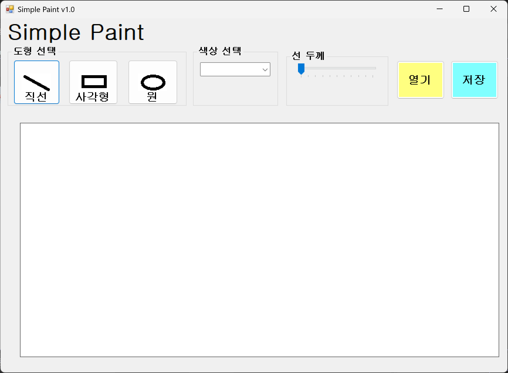
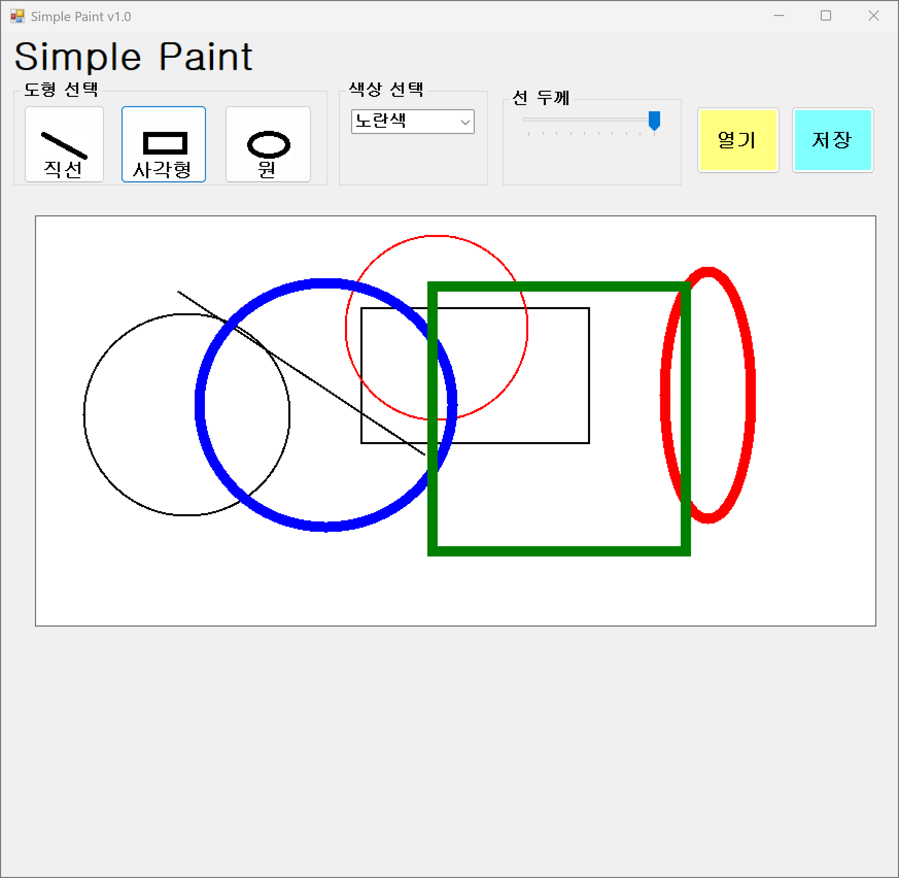
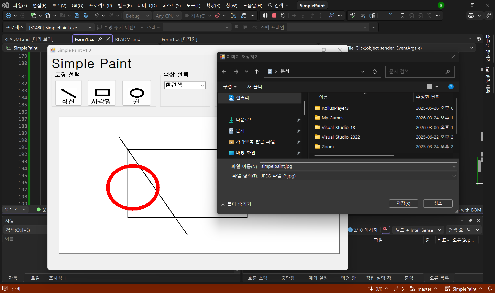
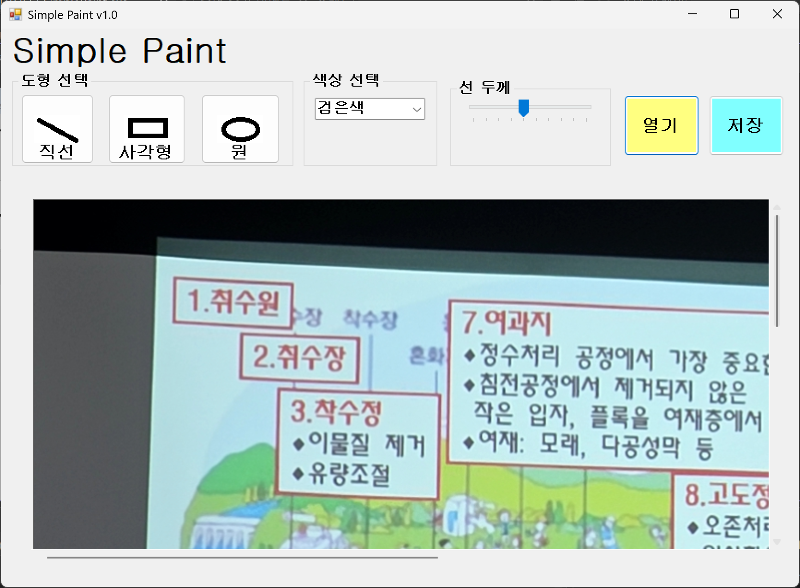

# (C# 코딩) 그림판
## 개요
- C# 프로그래밍학습
- 1줄소개: 그림을 그릴 수 있는 간단한 그림판
- 사용한플랫폼: 
  - C#, .NET Windows Forms, Visual Studio, GitHub
- 사용한컨트롤:
  - Label, TextBox, ListBox, Button, TrackBar, ComboBox 등
- 사용한 기술과 구현한 기능:
  - visual studio를 이용한 ui 디자인.
  - 버튼을 이용하여 도형을 선택하여 그림을 그릴 수 있도록 구현함.
  - 트렉바를 이용하여 선 두께를 조절할 수 있도록 함. 
  - 버튼을 적절히 위치하여 파일을 저장하고, 열 수 있도록 디자인 함. 
  - 픽처박스를 아래에 크게 위치시켜 그림을 그릴 수 있도록 함.

## 실행화면(과제1)
-코드의실행스크린샷과구현내용설명

- 구현한 내용(위 그림 참조):
  - 도형을 선택할 수 있는 버튼과 선 두께를 조절할 수 있는 트렉바, 파일을 저장하고 열 수 있는 버튼이 위치해 있음.
  - 아래에는 픽처박스가 크게 위치하여 그림을 그릴 수 있도록 디자인 되어 있음.
  - 버튼을 적절히 배치하여 사용자가 쉽게 접근할 수 있도록 함.
  - 사용자가 그림을 그릴 수 있는 픽처박스와 열기 버튼, 저장 버튼, 도형 선택 버튼을 배경과 색상을 달리 하여 사용자의 편의성을 높임.

## 실행화면(과제2)
-코드의실행스크린샷과구현내용설명

- 구현한 내용(위 그림 참조):
  - 마우스 드래그를 이용한 그림 그리기 기능 구현. 
  - 직선, 사각형, 원 등의 도형을 선택하여 그릴 수 있도록 구현.
  - 드래그 여부, 드래그 시작점, 드래그 끝점, 비트맵, 선택된 도형, 현재 색상, 현재 색 두께를 변수로 선언하여 기능을 구현함.
  - 앱이 실행될 때 캔버스가 초기화 될 수 있도록 캔버스 초기화, 마우스 이벤트, 도형 선택 버튼 이벤트, 색상 콤보박스 이벤트, 선 두께 트랙바 이벤트, 마우스 드래그 이벤트 등을 연결함.

## 실행화면(과제3)
-코드의실행스크린샷과구현내용설명

- 구현한 내용(위 그림 참조):
  - 그려진 그림을 이미지 파일로 저장하는 기능을 구현함. 
  - 파일 저장을 할 때 포맥을 정할 수 있도록 파일 저장 대화상자 saveFileDialog를 사용함. 
  - png, jpg, bmp 등의 포맷으로 저장할 수 있도록 구현함.
  - 캔버스에 그려진 그림을 여러가지 형식으로 선택하여 그림을 저장할 수 있도록 구현함.

## 실행화면(과제4)
-코드의실행스크린샷과구현내용설명

- 구현한 내용(위 그림 참조):
  - 외부에서 이미지 파일을 읽어 들여서 그걸 캔버스로 삼아 그 위에 드리고, 완성된 그림을 파일로 저장하는 기능을 구현함.
  - 외부에서 이미지 파일을 읽어 들여서 캔버스로 사용함.
  - 이미지 크기가 큰 경우 스크롤바를 만들어 이미지의 위 아래, 상하 좌우를 이동할 수 있도록 구현함.
  - 확대/축소 기능을 구현하여 이미지 크기를 조절하여 사용자가 원하는 크기로 이미지를 볼 수 있도록 함.